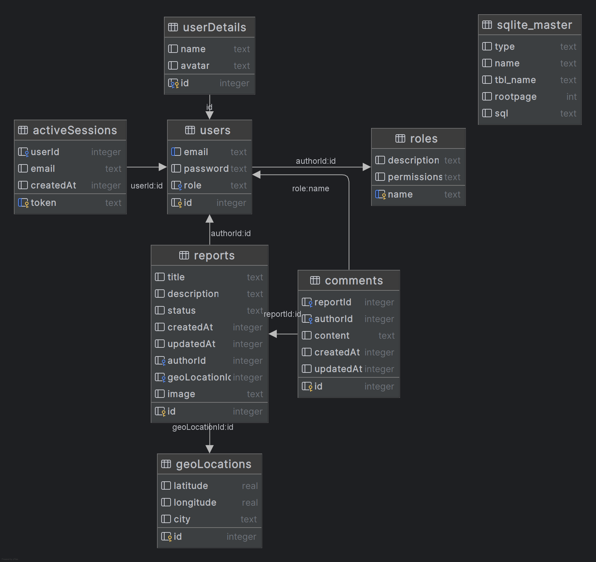

# EcoCity

EcoCity is a web application for reporting and monitoring environmental issues. It allows users to submit reports about pollution,
illegal dumping, and other environmental concerns,
and engage with the community through comments and discussions.

## Features

- **User Authentication**: Secure login and registration system
- **Environmental Reporting**: Submit reports with location data and images
- **Interactive Dashboard**: View your submitted reports and activity
- **Community Engagement**: Comment on reports and collaborate on solutions
- **Geolocation**: Automatic location detection and city name resolution

## Installation

### With Docker

1. Clone the repository:

   ```bash
   git clone https://github.com/JakubKorytko/EcoCity.git
   cd EcoCity
   ```

1. Run the Docker container:

   ```bash
   docker-compose up --build
   ```

### Without Docker

**Prerequisites:** - Node.js (v20 or higher) - SQLite3

1. Clone the repository:

   ```bash
   git clone https://github.com/JakubKorytko/EcoCity.git
   cd EcoCity
   ```

1. Run the application:

   ```bash
   node pig.mjs
   ```

## Project Structure

```
ecocity/
├── server/               # Server-side code
│   ├── api/              # API endpoints
│   ├── database/         # Database setup and ORM
│   └── index.mjs         # Server entry point
├── src/                  # Client-side code
│   ├── components/       # UI components
│   ├── pages/            # Pages
│   ├── public/           # Public assets
│   ├── modules/          # JavaScript modules
│   └── App.pig.mjs       # Routing entry point
└── Pig.html              # Main HTML file
```

## Database Schema



## API Endpoints

- `GET /api/reports` - Get all reports
- `GET /api/comments` - Get comments for a report
- `GET /api/users` - Get users details
- `POST /api/login` - Authenticate a user
- `POST /api/logout` - End a user session
- `POST /api/session` - Get session information & verify user authentication

## Technologies

- **Frontend**: Custom UI framework with HTML components
- **Backend**: Node.js with custom server implementation
- **Database**: SQLite with custom ORM
- **Authentication**: Token-based session management
- **Geolocation**: Integration with OpenStreetMap Nominatim API

## Security

- Passwords are hashed before storage
- Sessions expire after 1 hour of inactivity
- HTTPS recommended for production use

## License

[MIT License](LICENSE)

**Font Awesome icons are used in this project, check out their [license](https://fontawesome.com/license/free) for more details.**
